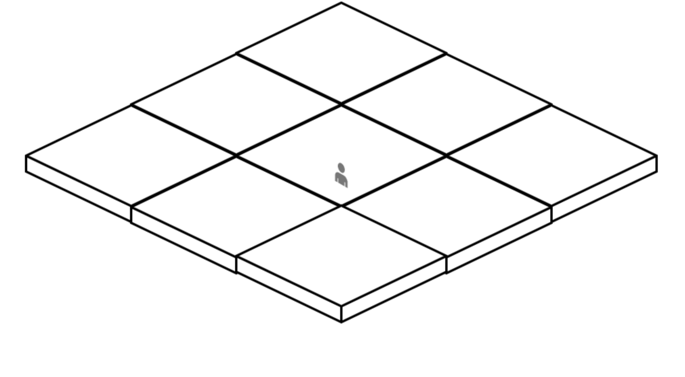
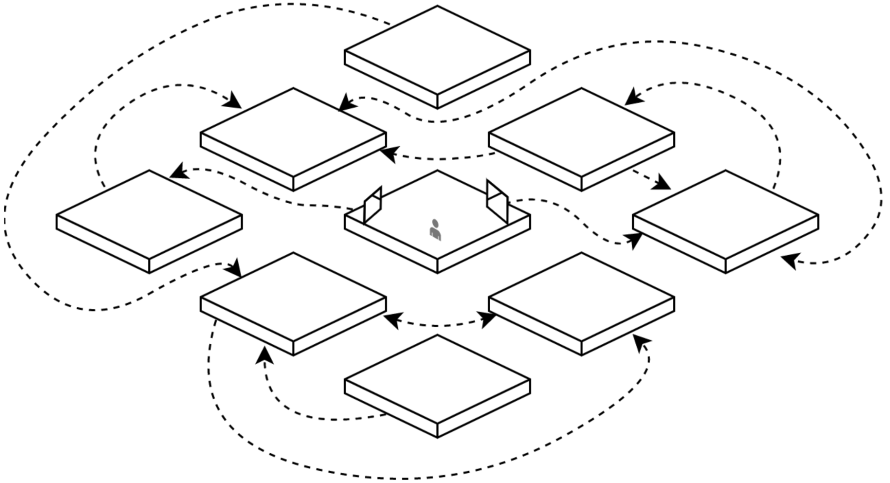
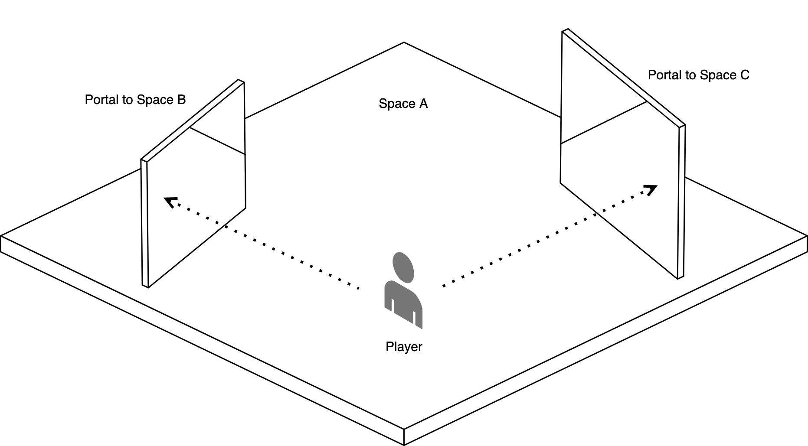

# Nfinity <!-- omit in toc -->

**A Better Land Economy for the Metaverse**

[nfinity.space](https://nfinity.space) • [nfinity.eth](https://nfinity.eth.xyz/)

 

Author: Jimmie Tyrrell • [jimmie@nfinity.space](mailto:jimmie@nfinity.space)

---

**Abstract.** For the Metaverse to achieve wider adoption, it must solve, rather than perpetuate, problems caused by artificial scarcity and physical constraints. These factors have made land in the Metaverse cost prohibitive, and have caused a land grab leaving much of it owned, but barren (dead-space). A naive solution would simply uncap the supply of land, but that would negate the investment incentive of purchasing land, which would curb adoption. Furthermore, it does not solve the problem of dead-space. A better solution is to forgo real-world inspired structure (like the grid), and instead use a graph-based approach, where land nodes can be dynamically linked and unlinked as needed. To ensure the economy instills confidence as an investment, land can earn the ability to create more links over time ("appreciation of utility"). Such a solution can be made a public good service so that the model becomes widely adopted, and
other projects can use it as their underlying spatial structure.

- [Introduction](#introduction)
- [Overview](#overview)
- [The Nfinity Model](#the-nfinity-model)
  - [Infinite Space](#infinite-space)
  - [Land Autonomy](#land-autonomy)
  - [Land Value Appreciation](#land-value-appreciation)
- [The Nfinity Spatial Service](#the-nfinity-spatial-service)
  - [Terminology](#terminology)
  - [Spaces](#spaces)
  - [Portals](#portals)
  - [Points](#points)
  - [Enhancements](#enhancements)
  - [Issuance](#issuance)
- [Implications](#implications)
  - [Migratory Dynamics](#migratory-dynamics)
  - [New Medium](#new-medium)
- [Future Work](#future-work)
- [The Nfinity DAO](#the-nfinity-dao)
  - [Partnerships and Evangelism](#partnerships-and-evangelism)
  - [Reference Implementations and Developer Tools](#reference-implementations-and-developer-tools)
- [Conclusion](#conclusion)
- [Note and Further Reading](#note-and-further-reading)
  - [Notes](#notes)
  - [Further Reading](#further-reading)

## Introduction

Nearly all contemporary metaverses, blockchain-backed or not, have a similar economic model that relies on the artificial scarcity of space to ensure a stable land economy. This model appears to have stemmed from economic laws that occur in our physical world, where land is inherently scarce, and therefore a reliable investment.

However, in the virtual world, there are several negative and perhaps unforeseen side-effects this approach has had:

1. **Inequitability.** Artificial scarcity has caused a land grab, raising the cost of space to unsustainable levels. Even the least-demanded land in the metaverse is cost-prohibitive (as far as digital goods go). This restricts the metaverse to those who have the financial means to participate in it.

2. **Squatters and dead-space.** Metaverse space is primarily purchased as an investment, rather than a space to showcase interesting content. Without engaging content, the Metaverse appears lifeless and empty. When a user _does_ add something interesting to the Metaverse, they increase the value of the adjacent land, attracting new buyers who intend to capitalize on this, and leave it barren and unsightly. So content-creators are actually punished for creating valuable content.

3. **Barrier to adoption.** New users are quick to identify these problems, as evidenced by the numerous editorials highlighting these very flaws (see [Further Reading](#further-reading)). The prices and lack of interesting content result in a bad impression of the Metaverse. Users who might have contributed to the Metaverse by adding content instead abandon the idea altogether.

These side-effects have resulted in a self-perpetuating cycle that threatens the future of Metaverse adoption.

## Overview

Nfinity intends to solve the aforementioned problems by providing the following:

1. **A Model**: an open-source strategy for land economics that metaverses may employ.
2. **A Service**: a decentralized application that manages virtual space according to said model, which other metaverses may build on top of.

Nfinity's offerings will be provided and governed by a decentralized autonomous organization, the Nfinity DAO. The DAO will serve to define the model, maintain the service, and promote equitable land ownership through the Metaverse.

## The Nfinity Model

The Nfinity land economic model defines three core characteristics. For a system to be in accordance with Nfinity's model, it must adhere to all three. These characteristics are:

1. Infinite Space
2. Land Autonomy
3. Land Value Appreciation

### Infinite Space

Ownership of land is one of the minimum requirements to participate in a metaverse. When land is cost-prohibitive, a class system arises with two distinct roles; the landowners and the land-less. Of course, a user _can_ engage with a metaverse even if they don't have land. But this type of dichotomy is something that we've seen occur in the physical world. We can avoid this in the Metaverse by making it more inclusive.

If the Metaverse is to become as pervasive as, say, cryptocurrency, then land must be as abundant as addresses are on the blockchain. Just like address ownership, there should be minimal barriers to owning land. Infinite space is an obvious way to make this happen. If land ownership is accessible to everyone, then the system is considered to be inclusive and equitable. In an equitable system, users are more likely to join, participate, and create content, so the barrier to entry is lower.

On its own, the concept of infinite space solves problems around equitability and adoption. However, the consequences of uncapped land supply must be dealt with appropriately; we discuss some strategies further down.

### Land Autonomy

Land autonomy is the freedom for landowners to govern their land however they want. Usually, this freedom applies to the content associated with one's land, but there's another type of autonomy that has become important in the Metaverse; the freedom to control what one's land is surrounded by.

In a grid-based land system, land is static. It can't be relocated, nor can the land neighboring it be; all land is "landlocked" by its immovable neighbors. This has caused problems for content creators, the people who increase the value of their neighborhoods and give life to the Metaverse. Landowners are essentially punished for placing engaging or compelling content in their space. It attracts squatters to buy the land around them, which is left barren and creates an unsightly wasteland around their content.

<table border="0" align="center">
    <tr>
        <td width="400">
            
            Land in a grid-based system is always "landlocked" by immovable, adjacent land
        </td>
    </tr>
</table>

Land should have the capacity to exist in isolation from all other land in the system. Landowners should be able to choose if and when they want to introduce neighboring land. This level of land autonomy ensures that dead-space doesn't crop up around all interesting content in the Metaverse. But it's practically impossible to provide land autonomy in a system that mimics the limitations of the physical world. However, the versatility of virtual space makes it easy. One solution is to use a graph-based structure instead of a grid-based one, and to link land nodes together via unidirectional or bidirectional "portals".

<table border="0" align="center">
    <tr>
        <td width="400">
            
            Land in a graph-based system can be linked together via "portals." The structure can be reconfigured as needed. This gives landowners the ability to choose their neighbors.
        </td>
    </tr>
</table>

In this approach, landowners needn't worry about attracting unwanted attention. If their neighbors are harming their experience in the Metaverse, they can simply pick new ones. This mitigates the threat of squatters, so newcomers to the Metaverse won't be overwhelmed with unsightly dead-space, resulting in an increase in adoption.

### Land Value Appreciation

To sustain a land economy, the market must guarantee reliable appreciation and instill economic confidence. This guarantee gives potential buyers the confidence to acquire land and populate it it. When the population increases, the social graph becomes more dense and more opportunities for trade and commerce emerge. These new opportunities provide new potential buyers with confidence in the economy. This could be described as a virtuous cycle.

<table border="0" align="center">
    <tr>
        <td width="520">
            
            Virtuous cycle of economic growth and population growth
        </td>
    </tr>
</table>

In a land economy with scarce resources, economic confidence comes naturally, because it is guaranteed to appreciate. Demand grows as the population increases, while supply stays static, so the price of land can be expected to rise. This expectation is a key component in economic confidence, without which, the entire cycle breaks down.

Uncapping the supply of land without any further contingencies would remove the natural economic confidence from the equation. Land value would not appreciate naturally, and as a by-product, adoption would curb, followed by economic growth. This would create the opposite effect; a viscous cycle. For adoption to increase, a system with abundant supply needs a way for land to appreciate.

To solve this, we propose a system whereby the _utility_ of land, rather than the supply, is artificially limited. However, as the land ages, those limitations will be loosened. Some example limitations include the physical size (footprint) of the land, the number of connections to other lands it may have, and the shape or size of those connections.

Limiting these attributes is another form of artificial scarcity, but it ensures that land appreciates over time. A side benefit is that the system can decide how much utility each plot of land starts with, and at what rate those restrictions are removed. This creates a very predictable appreciation curve, which will reinforce confidence.

One system might create land with minimal restrictions (i.e., high utility), and with a slower curve to removing them. Another might create land with many restrictions (i.e., low utility), but a faster curve to removing them. In either case, the economy has inputs that set it in motion with a stable and predictable trajectory.

<table border="0" align="center">
    <tr>
        <td width="400">
            
            
            Example of a system with low initial utility, but an extreme ramp-up curve.
            
        </td>
        <td width="20" class="spacer"></td>
        <td width="400">
            
            
            Example of a system with higher initial utility, but a gentler ramp-up curve.
            
        </td>
    </tr>
</table>

## The Nfinity Spatial Service

The Nfinity model will be deployed as a general-purpose, public good service so that other metaverses may use it as their spatial underpinning. By general-purpose, we mean that the metadata it provides will be barebones; it will host nothing more than information regarding the land itself, its size, links, age, etc. Other projects are free to add features on top of that as needed. In our efforts to maintain a public good, we hope to imitate other successful service-DAOs like the Ethereum Name Service (ENS).

### Terminology

* **Spaces** - Nfinity's name for "land." Since Nfinity is meant to be general-purpose, the term "land" might not always be applicable, so Space is used instead.
* **Portals** - Links between Space nodes. The "edges" of the graph model described above.
* **Points** - A currency that Spaces earn over time that can be traded for Enhancements.
* **Enhancements -** Upgrades to Spaces that increase their utility.

### Spaces

Spaces are ERC-721 compatible, non-fungible tokens representing plots of "land" in the Nfinity graph. They are nodes on the graph structure that defines Nfinity's geometry. They can be minted by interfacing with the Nfinity smart contract. The price for minting a new Space will be controlled by the Nfinity DAO, and the profits from that will be controlled according to the allocation rules described further down.

Spaces have no traditional Euclidean coordinates. Their size is defined by 2-dimensions (width and depth). They have no defined vertical height; this is left as a metaverse-specific design choice. The default footprint of a Space is 16x16 units. "Units" are generally suggested to map to "meters" when represented visually, but that's not a requirement. The same Space that can represent a room in one metaverse can represent an entire city in another.

Spaces accrue Points over time, according to the rules of an accrual schedule defined in the smart contract. The actual formula of the schedule is defined further below. Lastly, each Space contains a list of zero or more Portals that connect it to other Spaces.

<table border="0" align="center">
    <tr>
        <td width="400">
            
            
                Example visual representation of a Space with 2 Portals.
            
        </td>
        <td width="20" class="spacer"></td>
        <td width="400">
            <pre>struct Space {
    uint id;
    uint createdAt;
    uint initialPoints;
    uint bonusPoints;
    uint width;
    uint depth;
    Portal[] portals;
}</pre>
            
                Example schema of  an Nfinity Space struct
            
        </td>
    </tr>
</table>

### Portals

Portals are the links that connect Spaces. In graph terminology, they are the edges that connect nodes. Portals can have a destination; an exit portal. The destination can be a Portal in the same Space, or a Portal anywhere else on the Nfinity graph. A Portal can link to any destination, even if the destination doesn't link back to it; Portals can be one-way. They can be placed anywhere within a Space at any angle. They have position and rotation fields to accommodate this. They also have dimensions (width and height) to denote how large they are. The default width and height of a Portal is 4x5 units.

Portals can be rendered in whatever way makes the most sense for the given metaverse. Ideally, Portals are rendered as seamless windows into another Space that a player can both look through and step into (as in the 2007 video game, Portal.) However, due to technical limitations, this might not always be feasible. Alternative visual representations and user experiences might make more sense. Portals are assumed to be planes, i.e. their depth is 0. This ensures that they can be placed against walls and other objects without rendering glitches. Portals only need one side, an "entrance" side; the back of the plane can be a solid color, invisible, or another entrance.

<table border="0" align="center">
    <tr>
        <td width="400">
            
            Example visual representation of two Portals rendered as "windows" into another Space
        </td>
        <td width="20" class="spacer"></td>
        <td width="400">
            <pre>struct Portal {
    uint id;
    uint destinationId;
    uint width;
    uint height;
    Vector3 position;
    Vector3 rotation;
}</pre>
            
                Example schema of an Nfinity Portal struct
            
        </td>
    </tr>
</table>

### Points

Points in Nfinity are like experience points (XP) in many role-playing video and tabletop games. In those games, players can cash in their experience points for upgrades or new abilities. The same is true for Spaces.

Every Space has some quantity of Points available that increases over time, according to a predefined schedule or formula. That schedule is determined by the Nfinity DAO. Points are _not_ tokens; they cannot be transferred individually. This is intentional so that older Spaces have the highest utility (and therefore, value.) Newcomers to the system will not have a way to "cheat" the market. For example, they won't be able to buy many Spaces en masse, transfer their initial Points away, and consolidate them into one Space. There are only two ways to get a Space with high utility: Buy one from someone else, or wait for the Space to accrue Points.

The Point accrual schedule will be represented as a sequence of tuples, each containing an age (in days), and an amount of Points to be rewarded. The sequence can then be interpolated to determine how many Points a Space of arbitrary age has accumulated. An easy way to visualize this is to simply create a line graph of those tuples.

<table border="0" align="center">
    <tr>
        <td width="520">
            
            Example Point accrual schedule. In this example, a Space aged 600 days will have accrued 48 Points.
        </td>
    </tr>
</table>

The accrual schedule will be stored directly on-chain. The Nfinity DAO will periodically vote on changes to it, and eventually, it will be modified directly through on-chain governance.

### Enhancements

Enhancements are upgrades that give a Space more utility. They can be applied by the owner of the Space. Each enhancement will cost some amount of Points, and the exchange rate will be determined by the Nfinity DAO. Some enhancements that can be applied today are:

1. Increase the footprint of the Space (width, depth)
2. Increase the number of Portals in the Space
3. Increase the size (width, height) of an individual Portal

Enhancements may be "broken down", i.e., exchanged back into Points. This ensures that Spaces can be continuously enhanced without the risk of devaluing them due to some misspent Points. Therefore, all Spaces that are the same age are ostensibly equal in value, because they should have the same number of Points, whether they've been converted into Enhancements or not. The costs (if any) of breaking down Enhancements will be determined by the Nfinity DAO.

Landowners will decide which Enhancements they want most given the Points they have available to spend. Some landowners might opt for a Space that maximizes the number of Portals they have. Other landowners might want one or two Portals that are the size of a  drive-in theater screen. Others might want only to maximize the footprint of their Space. Any of these configurations are possible without devaluing the Space.

<table border="0" align="center">
    <tr>
        <td width="400">
            
            Rendering of a Space that has applied all available Points toward one massive Portal
        </td>
        <td width="20" class="spacer"></td>
        <td width="400">
            
            Rendering of a Space that has opted for several smaller Portals, using a comparable amount of Points.
        </td>
    </tr>
</table>

### Issuance

The Nfinity Service will have a few phases where Spaces can be created:

1. Reserve
2. Pre-sale
3. Public sale

In all phases, when Spaces are minted, they immediately start accruing Points. This is always true for Spaces.

During the reserve phase, the Nfinity DAO will mint a finite quantity of Spaces that it will keep for future use. One use will be to create an Nfinity land network that can serve as one hub in the Metaverse. This cluster of land might be comparable to Decentraland's Genesis Plaza. The DAO can also use these Spaces in the future to reward contributors or refund players in the event of a bug.

The pre-sale period will happen very shortly after the reserve phase. It will be a limited-time crowdfunding event where users can mint Spaces. The benefit to minting Spaces early is that they will immediately start accruing Points, so pre-sale contributors will have some of the most high-utility, high-value Spaces when the system launches. During the pre-sale period, Nfinity will have limited functionality, and virtually no partnerships or implementations slated. This period is primarily to secure space in Nfinity and to help kickstart Nfinity's efforts.

Once the model and service are finalized and deployed, the service will be activated so that the general public can mint Spaces.

## Implications

The Nfinity approach solves many other real-world problems that are sure to exist in the Metaverse if it ever hits critical mass.

### Migratory Dynamics

Several population phenomena occur in the real world that would not occur in a space-rich environment. We briefly describe some of them here.

**Overpopulation.** If a metaverse with scarce land ever achieves mass adoption, one eventuality is that it will become overpopulated. Typically in the real world, government policies must ensure the safety and security of densely populated areas. They might even take drastic measures, like closing borders, or tightening the restrictions on potential immigrants. In Nfinity, none of this is necessary, because overpopulation is unlikely when there's abundant space. Furthermore, because Nfinity Space owners can choose their neighbors, they can choose how much of the surrounding system they want to participate in. So even simply the visual effects of overpopulation are avoidable.

**Gentrification.** Similarly, when space is limited, neighborhoods face the possibility of becoming gentrified. This usually happens when a population with more income moves into the area, driving up prices, causing residents to no longer be able to afford living there. But for the same reasons that overpopulation won't happen in Nfinity, no user will ever be forced out of their community. In fact, in Nfinity, we might see multiple communities entangled together without negatively affecting one another.

**Underprivileged Communities.** In the real world, some communities have been forced (often, systematically) into economic situations that are hard to recover from. As a result, their occupants have no means to exit the community. This is less likely to occur in Nfinity because there is practically no cost or barrier to changing one's community.

### New Medium

**Self Expression.** It's possible for landowners to use the features of Nfinity to develop new forms of self-expression; whether they're artistic, conceptual, organizational, etc. Virtual land has become a sort of 3d version of a customizable, social network profile page. In Nfinity, the customizability even extends to who one chooses as neighbors, and how they wish to display them. This could be both good and bad; an individual might create a Portal to their favorite neighbor and frame it with a heart shape. They might also create a Portal to an unliked neighbor and frame it with something more offensive. So not only will this create new forms of expression, but also new forms of cyber-bullying. Systems that provide opt-in, consensus-based censorship will need to be developed in a layer separate from Nfinity.

**Marketing Channel.** The Metaverse has already seen the emergence of a new market in which land can be sold as ad space. In Nfinity, landowners whose land is highly trafficked might be able to rent their Portals out to the highest bidders; similar to how influencers can market products to their followers. Again, there is good and bad that comes with this. One benefit to Nfinity's structure however is that landowners can't be "locked-in" next to another landowner that has filled their property with ads. So this is both a new form of advertising that is also self-policing.

## Future Work

Nfinity introduces a new paradigm to virtual land, and there are many avenues for further exploration. The Nfinity DAO will ensure that these features and more are properly researched, evangelized, and voted on for support in the future.

**Filterable Portals.**
A way to tag Portals so that different metaverses can choose how to display them, or to ignore them altogether. For example, a metaverse that displays Portals purely for aesthetic purposes might want to only render Portals tagged with a `decoration` tag, and ignore all others. A metaverse that is intended to be a maze structure might only want to render Portals tagged with a `maze` tag.

**Searchable Portals.** Similar to the above, a tagging system could be used to create a folksonomy for Portals and their contents. For example, one user tags a Portal with the tag `cats` because it links to a Space with cat-related art. Another user searches for Portals tagged `cats` to find all the cat-related content in the Metaverse. Since 3d Portals are the gateways to this content, the search results are displayed in 3d too. The search engine constructs a temporary, dynamically generated hallway with many doorways. Each doorway connects to a Portal in the query's results. The user can walk through this custom-tailored hall to peek into each Space and browse its content.

**Programmable Portals.** Everything in the Metaverse has the potential to be programmable, and Portals are no exception. One approach is a system where Portals can delegate some (or all) of their attributes to another smart contract. Since Portals are not NFTs, the smart contract would not be able to do anything permanently destructive. There could be smart contracts that change a Portal's destination to the highest bidder. Or the account with the most recently acquired NFT from a collection. Or a random patron, to spotlight a Space owner's followers.

**Centralized Games.** Games that are better suited as centralized experiences can still use Nfinity to generate and connect land within the game. For example, a game like Minecraft can use the Portal definitions from Nfinity to overlay Portals in a Minecraft world. The Portals can connect users' different Minecraft server instances.

**Usage-Based Appreciation of Utility.** A more advanced Point-accrual process could be implemented, one that rewards benevolent use of the space. For example, Point accrual could be accelerated when other Spaces connect to one's Portals. It could be accelerated for Spaces that have used their Points for Enhancements. There could even be a voting system where users vote for which Spaces should accrue Points faster. In general, the goal is to reward landowners for making the Metaverse a more accessible and/or lively place.

## The Nfinity DAO

All aspects of Nfinity will be governed by a decentralized autonomous organization (DAO). The DAO will start by democratically defining the Nfinity model (this document). Eventually, the responsibilities of the DAO will be to develop and deploy the Nfinity service. After that, the DAO will continue refining the model, maintaining the service, and working in the interests of fair land in the Metaverse.

### Partnerships and Evangelism

For Nfinity's model and service to gain critical mass and acceptance, there will need to be an extensive effort to create partnerships, to ensure that new and existing projects adopt Nfinity. The Nfinity DAO will use some of the funds from its service's operation to market and evangelize Nfinity to Metaverse projects. The main attractions for new projects to use Nfinity as a spatial layer are:

1. The model will have been democratically chosen, and eventually proven.
2. Development time will be faster. New projects don't have to implement their own land system.
3. Faster user adoption. Users with land in Nfinity can quickly put it to use in another Metaverse. Also, the Nfinity DAO can cross-promote and help market metaverses that use Nfinity.

Up-and-coming metaverses will see the biggest benefits to partnering with Nfinity. Existing Metaverse projects might find that Nfinity is redundant or conflicting with their model. The Nfinity DAO will work with them to find a way to incorporate both models to the benefit of all. For example, in Decentraland, Spaces and plots could be merged by their owners so that Portals from Nfinity are pulled into Decentraland. Those Portals can take users to other plots in Decentraland if they've also been merged with an Nfinity Space.

In addition to a partnership program, Nfinity will use some of its funds to invest in upcoming Metaverse projects that can commit to using Nfinity. The DAO will define the terms of the program, investment amounts, acceptance criteria, etc.

### Reference Implementations and Developer Tools

The Nfinity DAO will fund the creation of lightweight metaverses to both prove the viability of Nfinity, and to provide the development community with templates for creating their own metaverses.

The first such reference implementation will be a 3d NFT art gallery, tentatively called the Nfinity Mall. That metaverse will dynamically generate a 3d art gallery for any Ethereum user's wallet, and overlay it over their space. It will render the Portals from Nfinity so that users may connect their galleries with others.

The Nfinity DAO will also produce open-source libraries and frameworks in popular game-development ecosystems to help developers build on top of Nfinity.

Beyond those projects, the development of a larger-scale metaverse might be warranted if incumbent metaverse offerings don't adopt Nfinity. In this case, Nfinity would create a full content system as a separate layer above the spatial system. The Nfinity DAO will vote on which effort to focus time and money into.

## Conclusion

The Metaverse has many criticisms, most of which stem from the overtly non-competitive market caused by artificial scarcity. We have described some of the self-sabotaging effects that this approach has had on the market and its adoption. The perception of the Metaverse is that land is extremely overvalued, it's being occupied mostly by squatters, and they've left it a barren wasteland, devoid of any compelling content. However, the worst offense is the sum of these flaws; the Metaverse is recreating problems that exist in the real world, but are entirely avoidable in a virtual world. The Metaverse was once seen as an escape from the inequities and limitations of real-life. But to many, it is instead an extension of the problems they face in the real world. With the two realities being essentially equivalent, it's understandable why many are hesitant to accept the Metaverse.

Nfinity intends to provide a framework and service so that virtual worlds can fulfill the promise of transcending physical limitations. It is a modern economic model that takes advantage of the abundance in virtual worlds to create a fair, equitable system of land ownership. It solves many problems that exist in real estate today and creates a more inclusive, accessible, and collaborative virtual environment that anyone can participate in. Nfinity is a new paradigm in virtual space that can have a positive impact on the direction of the Metaverse in the years to come.

## Note and Further Reading

### Notes

1. In practicality, we'll never really achieve "infinite space" in a virtual world, due to limitations in the physical world. There are plenty of oft-cited arguments for this position; integer overflow (which of course, can be worked around), the sun's exhaustion of hydrogen, the heat death of the universe, etc. However, the role of Nfinity is to conceptually define an economy as if land _were_ infinite, ignoring the limits of computation, space, time, entropy, etc., with the assumption that if these limitations become a threat, they will either be solved, or their effects on Nfinity will be irrelevant.

2. The virtuous cycle of economic growth holds true when resources are abundant. It breaks down when resources, specifically food, become scarce. Commonly referred to as a Malthusian Trap, it is essentially proven to be a non-issue long-term [1]. So we ignore it in this calculation.

### Further Reading

1. Julian Simon, [The Ultimate Resource](http://www.juliansimon.com/writings/Ultimate_Resource/) (Princeton, NJ: Princeton University Press, 1981).

2. [Artificial Scarcity Will Hurt the Metaverse](https://medium.com/the-ultra-reality/artificial-scarcity-will-hurt-the-metaverse-5609bbc82b1a)

3. [The Metaverse Land Rush Is an Illusion](https://www.wired.com/story/metaverse-land-rush-illusion/)

4. [Metaverse Scarcity Isn’t Real](https://www.coindesk.com/layer2/2022/01/11/metaverse-scarcity-isnt-real/)

5. [Games Demystified: Portal](https://www.gamasutra.com/view/feature/3770/games_demystified_portal.php)
