# Nfinity <!-- omit in toc -->

<div class="subtitle">

**Better Structure and Economics for Space in the Metaverse**

</div>

<div class="head">

[nfinity.space](https://nfinity.space) • [nfinity.eth](https://nfinity.eth.xyz/)

<br />

Author: Jimmie Tyrrell • [jimmie@nfinity.space](mailto:jimmie@nfinity.space)

</div>

---

<div class="abstract">

**Abstract.** For the Metaverse to achieve wider adoption, it must solve, rather than perpetuate, problems caused by artificial scarcity and real-world physics. These factors have caused space in the Metaverse to be overpriced and noninclusive. Speculators have engaged in a land grab, acquiring all of the available space, but leaving it devoid of any engaging content (dead-space) [1]. A naive solution would simply uncap the supply of space, but that would negate the investment incentive of purchasing space, which would curb adoption. Furthermore, it does not solve the problem of dead-space. A better solution is to forgo real-world, Euclidean structure (like a grid), and instead use a graph-based, non-Euclidean approach, where space nodes can be dynamically linked and unlinked as needed. To ensure the economy instills confidence as an investment, spaces can earn the ability to create more links over time ("appreciation of utility"). Such a solution can be made a public good service so that the model becomes widely adopted, and
other projects can use it as their underlying spatial structure.

</div>

- [Introduction](#introduction)
- [Overview](#overview)
- [The Nfinity Model](#the-nfinity-model)
  - [Infinite Space](#infinite-space)
  - [Autonomy](#autonomy)
  - [Appreciation](#appreciation)
- [The Nfinity Spatial Service](#the-nfinity-spatial-service)
  - [Terminology](#terminology)
  - [Systems](#systems)
  - [Spaces](#spaces)
    - [Space Participation in Systems](#space-participation-in-systems)
  - [Portals](#portals)
  - [XP (Experience Points)](#xp-experience-points)
  - [Upgrades](#upgrades)
  - [Uniform Resource Locators (URLs)](#uniform-resource-locators-urls)
    - [Special URLs](#special-urls)
    - [URLs as Structs in the Ethereum VM](#urls-as-structs-in-the-ethereum-vm)
  - [Issuance](#issuance)
- [Implications](#implications)
  - [Migratory Dynamics](#migratory-dynamics)
  - [New Medium](#new-medium)
- [Future Work](#future-work)
- [The Nfinity DAO](#the-nfinity-dao)
  - [Partnerships and Evangelism](#partnerships-and-evangelism)
  - [Reference Implementations and Developer Tools](#reference-implementations-and-developer-tools)
- [Conclusion](#conclusion)
- [Notes and Further Reading](#notes-and-further-reading)
  - [Notes](#notes)
  - [Further Reading](#further-reading)

## Introduction

Nearly all blockchain-backed metaverses have a similar economic model that relies on the artificial scarcity of space to ensure a stable economy. This model has stemmed from natural economic occurrences in our physical world, where land is inherently scarce, and therefore a reliable investment.

However, in the virtual world, there are several negative and perhaps unforeseen side-effects this approach has had:

1. **Inequitability.** Artificial scarcity has caused a land grab, raising the cost of space to unsustainable levels. Even the least-demanded space in the metaverse is cost-prohibitive (as far as digital goods go). This restricts the metaverse to those who have the financial means to participate in it.

2. **Squatters and dead-space.** Metaverse space is primarily purchased as an investment, rather than a space to showcase interesting content. Without engaging content, the Metaverse appears lifeless and empty. When a user _does_ add something interesting to the Metaverse, they increase the value of the adjacent space, attracting new buyers who intend to capitalize on this, and leave it barren and unsightly. So content-creators are actually punished for creating valuable content.

3. **Barrier to adoption.** New users are quick to identify these problems, as evidenced by the numerous editorials highlighting these very flaws (see [Further Reading](#further-reading)). The prices and lack of interesting content result in a bad impression of the Metaverse. Users who might have contributed to the Metaverse by adding content instead abandon the idea altogether.

These side-effects have resulted in a self-perpetuating cycle that threatens the future of Metaverse adoption.

## Overview

Nfinity intends to solve the aforementioned problems by providing the following:

1. **A Model**: an open-source specification for structuring space and operating its economy, which any metaverse may adopt.
2. **A Service**: a decentralized application that manages virtual space according to said model, which any metaverse may build on top of.

Nfinity's offerings will be provided and governed by a decentralized autonomous organization, the Nfinity DAO. The DAO will serve to define the model, maintain the service, and promote equitable space ownership through the Metaverse.

## The Nfinity Model

The Nfinity Model defines both a data structure for virtual space, as well as requirements for the equitable management of that space.

Regarding the data structure, rather than a grid-based, static structure, like in the real-world, Nfinity is graph-based, dynamic, and non-Euclidean.

This approach has many similarities to [hypertext](https://dl.acm.org/doi/10.1145/800197.806036) [2]. In the 2d web, hypertext documents are connected together via hyperlinks. Nfinity can be interpreted as that concept extended to 3d. Instead of documents, Nfinity uses virtual space as a medium for displaying 3d content.

In Nfinity, each space is akin to a hypertext document for 3d content. One space can link to multiple other spaces, just like one webpage can hyperlink to multiple other webpages.

<table border="0" align="center">
    <tr>
        <td width="47.5%" align="center" valign="middle" class="figure">
          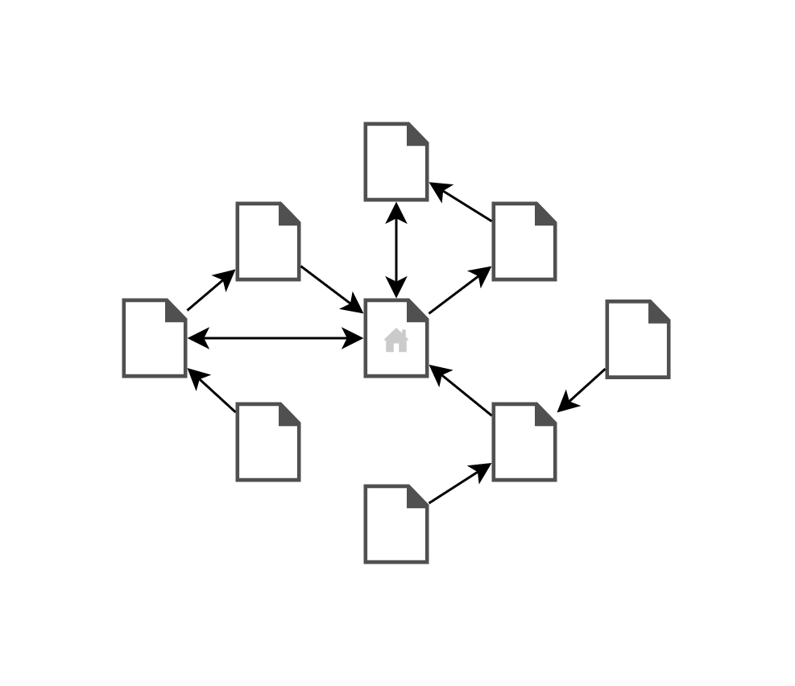
        </td>
        <td width="5%" class="spacer"></td>
        <td width="47.5%" align="center" valign="middle" class="figure">
          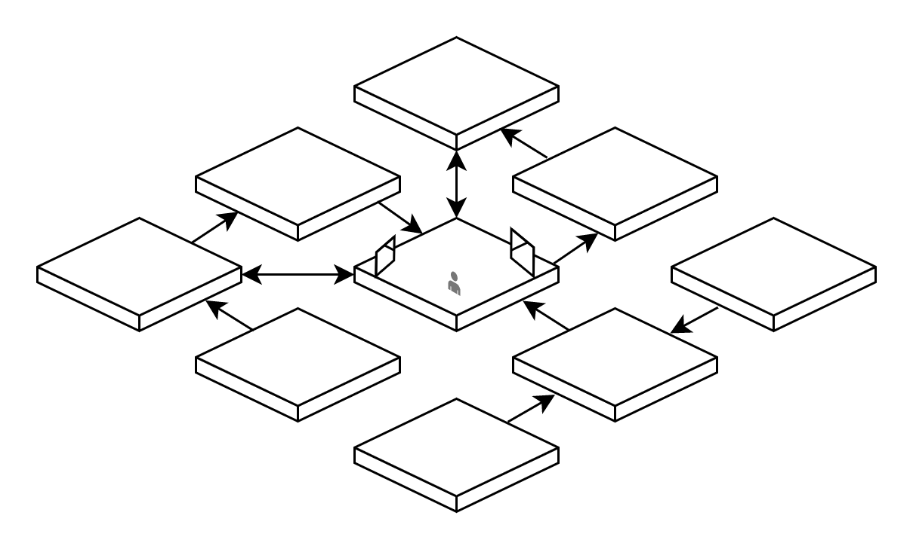
        </td>
    </tr>
    <tr>
        <td width="47.5%" valign="top">
          <sub>The web: Hypertext documents that are linked together via hyperlinks [2]</sub>
        </td>
        <td width="5%" class="spacer"></td>
        <td width="47.5%" valign="top">
          <sub>Nfinity: Space is linked together in a similar manner</sub>
        </td>
    </tr>
</table>

Aside from the virtual structure of the space, the model further defines three core principles on how that space is to be operated. These principles are:

1. Space must be infinite
2. Owners of a space must have full autonomy over it
3. Space must appreciate in value

### Infinite Space

Ownership of space is one of the minimum requirements to participating in a metaverse. When space is cost-prohibitive, a class system arises with two roles; those who can afford space, and those who can't. Of course, a user _can_ engage with a metaverse even if they don't own space in it. But this type of dichotomy is something that we've seen occur in the real world. We can avoid this in the Metaverse by exploiting the unlimited capacity of virtual space.

If the Metaverse is to become as pervasive as, say, cryptocurrency, then space must be as abundant as addresses are on the blockchain. Just like address ownership, there should be minimal barriers to owning space. Infinite space is an obvious way to make this happen. If space ownership is accessible and affordable to a majority of people, then the system is considered to be inclusive and equitable. In an equitable system, users are more likely to join, participate, and create content, which encourages others to do the same.

On its own, the concept of infinite space solves problems around equitability and adoption. However, the consequences of unlimited space (namely, inflation) must be dealt with appropriately; we discuss some strategies further down.

### Autonomy

Land autonomy is the freedom for landowners to govern their land however they want. Usually, this freedom applies to the contents of one's land, but there's another type of autonomy that has become important in the Metaverse; the freedom to control what one's land is surrounded by.

In a grid-based system, space is static. It can't be relocated, nor can the space neighboring it be; all space is "gridlocked" by its immovable neighbors. This has caused problems for content creators, the people who increase the value of their neighborhoods and give life to the Metaverse. Space owners are essentially punished for placing engaging or compelling content in their space. It attracts squatters to buy the space around them, which is left barren and creates an unsightly wasteland around their content.

<table border="0" align="center" width="400">
    <tr>
        <td align="center">
            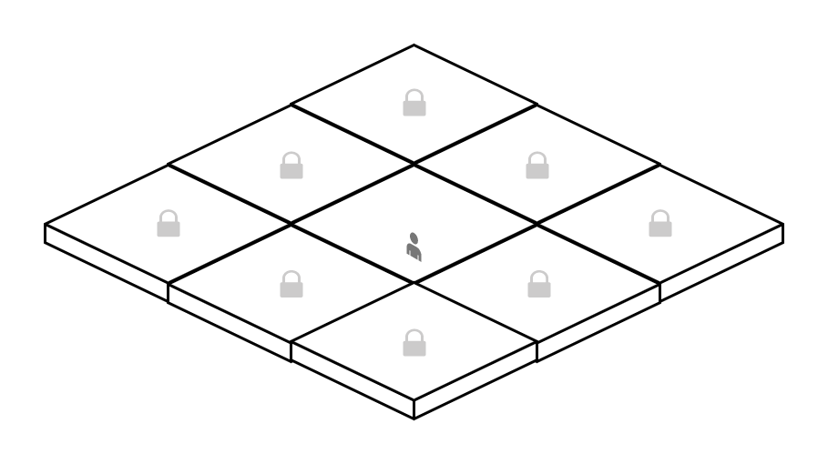<br />
            <sub>Space in a grid-based system is always "gridlocked" by immovable, adjacent space</sub>
        </td>
    </tr>
</table>

Space should have the capacity to exist in isolation from all other space in the system. Space owners should be able to choose if and when they want to introduce neighboring spaces. This level of autonomy ensures that dead-space doesn't crop up around all interesting content in the Metaverse. But it's practically impossible to provide autonomy in a system that mimics the limitations of the physical world. However, the versatility of virtual space makes it easy. One solution is to use a graph-based structure instead of a grid-based one, and to link space nodes together via unidirectional or bidirectional "portals".

In this approach, space owners needn't worry about attracting unwanted attention. If their neighbors are harming their experience in the Metaverse, they can simply pick new neighbors. This mitigates the threat of squatters, so newcomers to the Metaverse won't be overwhelmed with unsightly dead-space, resulting in an increase in adoption.

### Appreciation

To sustain a stable economy, the market must guarantee reliable appreciation of space and instill economic confidence. This guarantee gives potential buyers the confidence to acquire space and populate it. When the population increases, the social graph becomes more dense and more opportunities for trade and commerce emerge. These new opportunities provide new potential buyers with confidence in the economy. This could be described as a virtuous cycle.

<table border="0" align="center">
    <tr>
        <td width="520" align="center">
            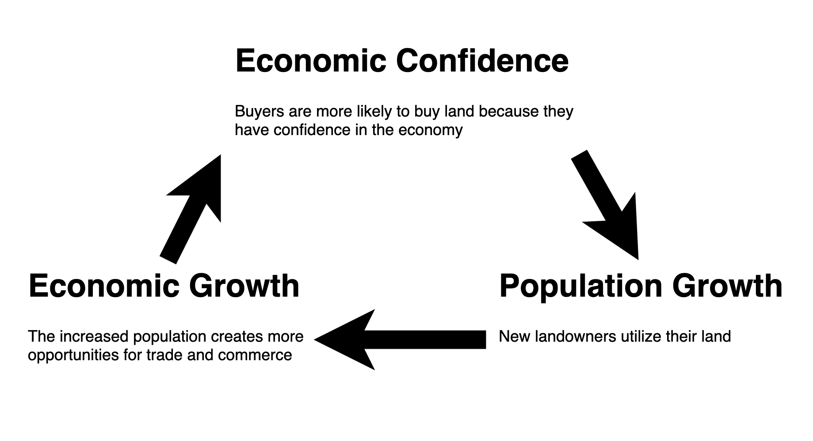
            <sub>Virtuous cycle of economic growth and population growth</sub>
        </td>
    </tr>
</table>

In an economy of a limited supply of space, economic confidence comes naturally, because the value of space is guaranteed to appreciate. Demand grows as the population increases, while supply stays static, so the price of space can be expected to rise. This expectation is an important factor that supports economic confidence.

Uncapping the supply of space without any further contingencies would remove the natural economic confidence from the equation. The value of space would not appreciate naturally, which would have a negative impact on adoption. Following that, economic growth would decrease. This would create the opposite effect; a vicious cycle of economic decline. For adoption to increase, a system with abundant supply needs a way for space to appreciate.

To solve this, we propose a system whereby the _utility_ of space, rather than the supply, is artificially limited. However, as the space ages, those limitations will be loosened. Some example limitations include the physical size (footprint) of the space, the number of connections to other spaces it may have, and the shape or size of those connections.

Limiting these attributes is another form of artificial scarcity, but it ensures that space appreciates over time. A side benefit is that the system can decide how much utility each space starts with, and at what rate those restrictions are removed. This creates a very predictable appreciation curve, which will reinforce confidence.

One system might create space with minimal restrictions (i.e., high utility), and with a slower curve to removing them. Another might create space with many restrictions (i.e., low utility), but a faster curve to removing them. In either case, the economy has inputs that set it in motion with a stable and predictable trajectory.

<table border="0" align="center">
    <tr>
        <td width="400">
            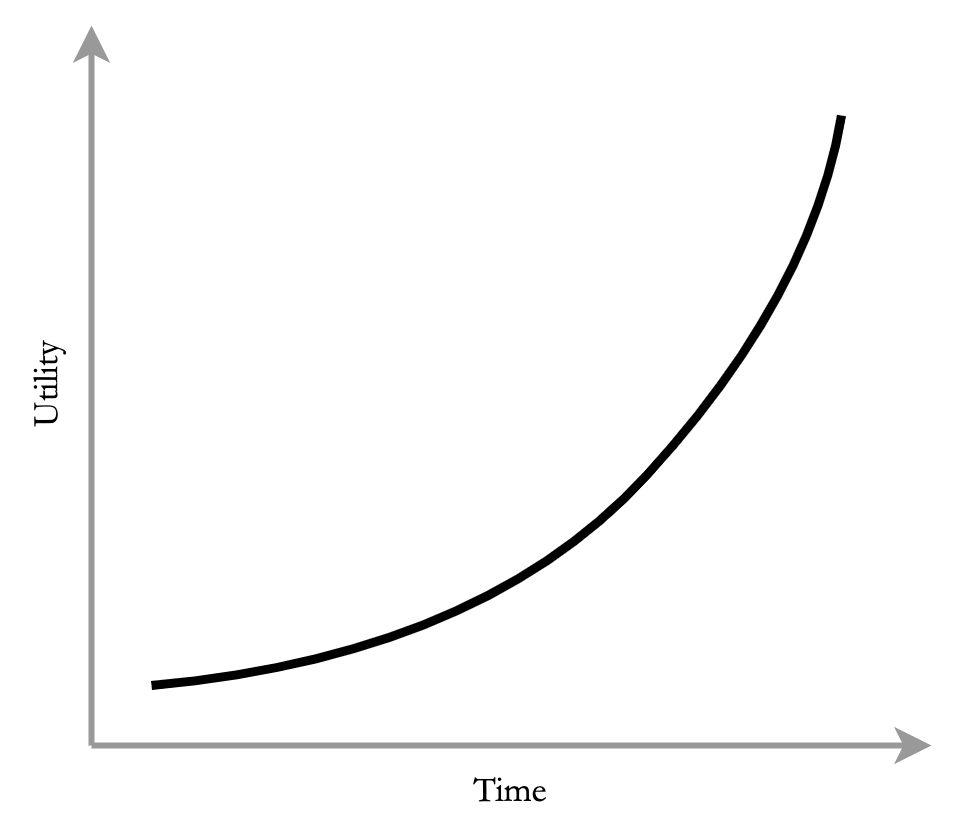
            <sub>
            Example of a system with low initial utility, but an extreme ramp-up curve.
            </sub>
        </td>
        <td width="20" class="spacer"></td>
        <td width="400">
            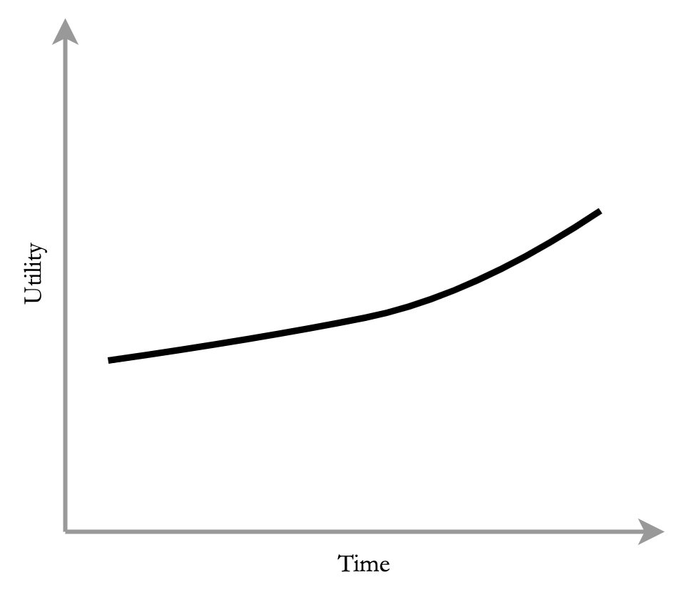
            <sub>
            Example of a system with higher initial utility, but a gentler ramp-up curve.
            </sub>
        </td>
    </tr>
</table>

## The Nfinity Spatial Service

The Nfinity model will be deployed as a general-purpose, public good service so that other metaverses may use it as their spatial underpinning. It is general-purpose in the sense that the metadata it provides will be barebones; it will host little more than information regarding the space itself, its size, links, age, etc. Other projects are free to add features on top of that as needed. In our efforts to maintain a public good, we hope to imitate other successful service-DAOs like the Ethereum Name Service (ENS).

### Terminology

* **System** - An ERC-721 token representing a graph, the spatial structure for a metaverse.
* **Space** - An ERC-721 representing a 3-dimensional areas which can be used to serve content. Spaces are nodes within a System.
* **Portal** - A link between Spaces. The "edges" within a System graph.
* **XP** - A non-ERC-721 currency that Spaces earn over time which can be traded for Upgrades.
* **Upgrade** - An incremental change to a Space that increases its utility.

### Systems

Systems are ERC-721 compatible, non-fungible tokens that represent graph structures which can contain any number of Spaces in them. They can be minted by interacting with the Nfinity Smart Contract. The price for minting a new Space will be controlled by the [Nfinity DAO](#the-nfinity-dao). More information on revenue earned from minting Systems is described in [Revenue and Allocations](#revenue-and-allocations).

Each System is a graph structure that metaverses can use as their spatial definition. Since this structure is public information, multiple metaverses can use the same System for their definition of space, but only one wallet can own the System's NFT.

It's also important to note that Spaces may be part of multiple Systems at the same time. This is described in greater detail in the [Spaces](#spaces) section.

<table border="0" align="center">
    <tr>
        <td width="600">
            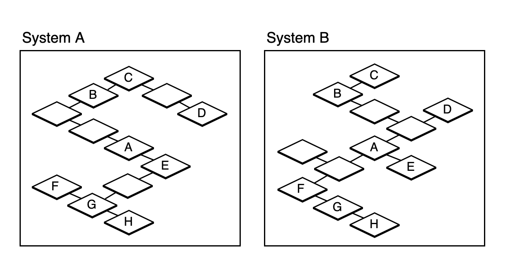
            <sub>
                Interpretation of two different System graph structures, each with their own network of Spaces. The Systems share some of the same Spaces (marked with letter identifiers A-H)
            </sub>
        </td>
    </tr>
</table>


### Spaces

Spaces are ERC-721 compatible, non-fungible tokens that represent 3d planes which can host 3d content. Spaces can be a part of one or more systems. They are the nodes within a System's graph structure. They can be minted by interacting with the Nfinity Smart Contract. The price for minting a new Space will be controlled by the [Nfinity DAO](#the-nfinity-dao). More information on revenue earned from minting Spaces is described in [Revenue and Allocations](#revenue-and-allocations).

Spaces have no traditional Euclidean coordinates. Their size is defined by 2-dimensions (width and depth). They have no defined vertical height; this is left as a metaverse-specific design choice. The default footprint of a Space is 16x16 units. "Units" are generally suggested to map to "meters" when represented visually, but that's not a requirement. The same Space that can represent a room in one metaverse can represent an entire city in another.

Spaces accrue XP over time, according to the rules of an accrual schedule defined in the smart contract. The actual formula of the schedule is defined further below. Lastly, each Space contains a list of zero or more Portals that connect it to other Spaces.

<table border="0" align="center">
    <tr>
        <td width="400">
            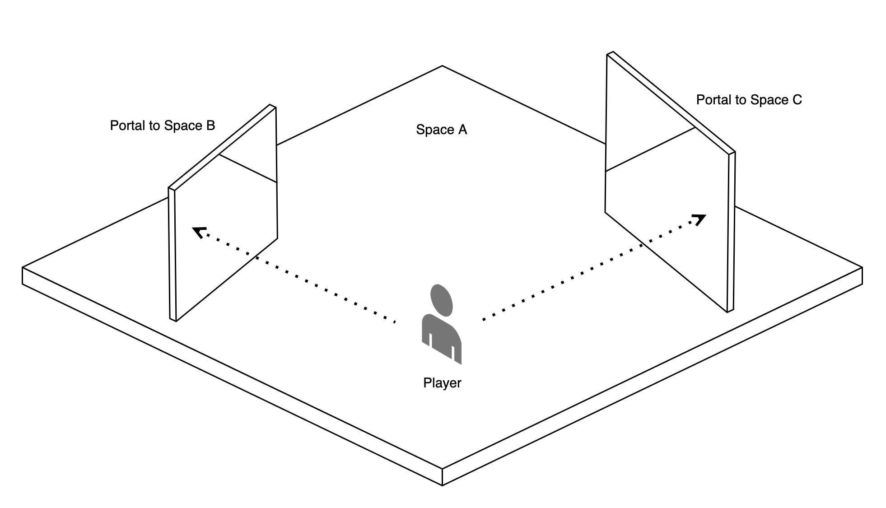
            <sub>
                Example visual representation of a Space with 2 Portals.
            </sub>
        </td>
        <td width="20" class="spacer"></td>
        <td width="400">
            <pre>struct Space {
    uint id;
    uint createdAt;
    uint initialXp;
    uint bonusXp;
    uint width;
    uint depth;
    Portal[] portals;
}</pre>
            <sub>
                Example schema of an Nfinity Space struct
            </sub>
        </td>
    </tr>
</table>

As described earlier, Spaces can be included in multiple Systems. It is up to the metaverse rendering the System/Spaces to determine if all of the Portals in a Space make sense in that metaverse, or if some should be ignored. For example, some metaverses may opt to hide cross-System Portals, and only show intra-System Portals.

Each Space also has a name field, which is the sha256 value of a name string that must be provided at the time of minting. The name may be changed at a later date.

#### Space Participation in Systems

When a Space is minted, it is not immediately a part of any System or metaverse. The owner of the Space must manually register their Space for participation in whichever System(s) they want it to appear in. Participation can be changed by interacting with the Nfinity Smart Contract. There will be no additional costs associated with such actions, other than the standard Ethereum transaction fees.

### Portals

Portals are the links that connect Spaces. In graph terminology, they are the edges that connect nodes. Portals can have a destination; an exit portal. The destination can be any other Nfinity Portal, even if it's not in the same System (cross-System Portals). However, some metaverses may choose to ignore such Portals for technical reasons, and only render Portals within the current system (intra-System Portals).

A Portal can link to any destination, even if the destination doesn't link back to it, i.e., Portals can be one-way, just like hyperlinks. The metaverse client can decide how to handle "back button" functionality, if at all. Portals can be placed anywhere within a Space at any angle. They have position and rotation fields to accommodate this. They also have dimensions (width and height) to denote how large they are. The default width and height of a Portal is 4x5 units.

Metaverse clients can render Portals in whatever way makes the most sense for that client. Ideally, Portals are rendered as seamless windows into another Space that a player can both look through and step into (as in the [2007 video game, Portal](https://www.gamasutra.com/view/feature/3770/games_demystified_portal.php) [3].) However, due to technical limitations, this might not always be feasible. Alternative visual representations and user experiences might make more sense. Portals are assumed to be planes, i.e., their depth is 0. This ensures that they can be placed against walls and other objects without rendering glitches. Portals only need one side, an "entrance" side; the back of the plane can be a solid color, invisible, or another entrance.

<table border="0" align="center">
    <tr>
        <td width="400">
            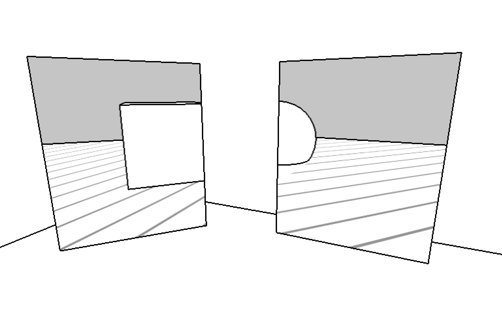
            <sub>Example visual representation of two Portals rendered as "windows" into another Space</sub>
        </td>
        <td width="20" class="spacer"></td>
        <td width="400">
            <pre>struct Portal {
    uint id;
    uint name;
    DestinationUrl destination;
    uint width;
    uint height;
    Vector3 position;
    Vector3 rotation;
}</pre>
            <sub>
                Example schema of an Nfinity Portal struct
            </sub>
        </td>
    </tr>
</table>

Each Portal has a destination field, which is itself a `DestinationUrl` struct. The schema for that struct is defined in [URLs as Structs in the Ethereum VM](#urls-as-structs-in-the-ethereum-vm). Each Portal also has a name field, which is the sha256 value of a name string that must be provided at the time of creation. It may also be changed at a later date.

### XP (Experience Points)

Experience Points in Nfinity function like [cash-in advancement Experience Points](https://en.wikipedia.org/wiki/Experience_point#Cash-in_advancement) [4] in many role-playing video and tabletop games. In those games, players can cash in their experience points for upgrades or new abilities. The same is true for XP in Spaces.

Every Space has some quantity of XP available that increases over time, according to a predefined schedule or formula. That schedule is determined by the Nfinity DAO. XP are _not_ ERC-721 tokens; they cannot be transferred individually. This is intentional so that older Spaces have the highest utility (and therefore, value.) Newcomers to the system will not have a way to "cheat" the market. For example, they won't be able to buy many Spaces en masse, transfer their initial XP away, and consolidate them into one Space. There are only two ways to get a Space with high utility: Buy one from someone else, or wait for the Space to accrue XP.

The XP accrual schedule will be represented as a sequence of tuples, each containing an age (in days), and an amount of XP to be rewarded. The sequence can then be interpolated to determine how many XP a Space of arbitrary age has accumulated. An easy way to visualize this is to simply create a line graph of those tuples.

<table border="0" align="center">
    <tr>
        <td width="520">
            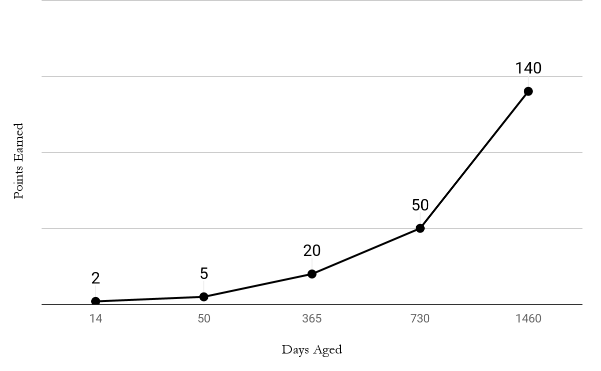
            <sub>Example XP accrual schedule. In this example, a Space aged 600 days will have accrued 48 XP.</sub>
        </td>
    </tr>
</table>

The accrual schedule will be stored directly on-chain. The Nfinity DAO will periodically vote on changes to it, and eventually, it will be modified directly through on-chain governance.

### Upgrades

Upgrades are incremental changes to a Space that give it more utility. They can be applied by the owner of the Space. Each Upgrade will cost some amount of XP, and the exchange rate will be determined by the Nfinity DAO. Some Upgrades that can be applied today are:

1. Increase the footprint of the Space (width, depth)
2. Increase the number of Portals in the Space
3. Increase the size (width, height) of an individual Portal

Upgrades may be "broken down", i.e., exchanged back into XP. This ensures that Spaces can be continuously enhanced without the risk of devaluing them due to some misspent XP. Therefore, all Spaces that are the same age are ostensibly equal in value, because they should have the same number of XP, whether they've been converted into Upgrades or not. The costs (if any) of breaking down Upgrades will be determined by the Nfinity DAO.

Space owners will decide which Upgrades they want most given the XP they have available to spend. Some Space owners might opt for a Space that maximizes the number of Portals they have. Other Space owners might want one or two Portals that are the size of a  drive-in theater screen. Others might want only to maximize the footprint of their Space. Any of these configurations are possible without devaluing the Space.

<table border="0" align="center">
    <tr>
        <td width="400">
            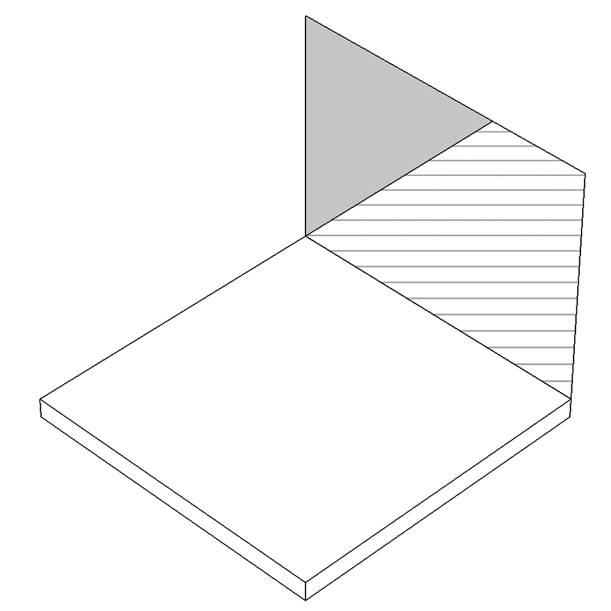
            <sub>Rendering of a Space that has applied all available XP toward one massive Portal</sub>
        </td>
        <td width="20" class="spacer"></td>
        <td width="400">
            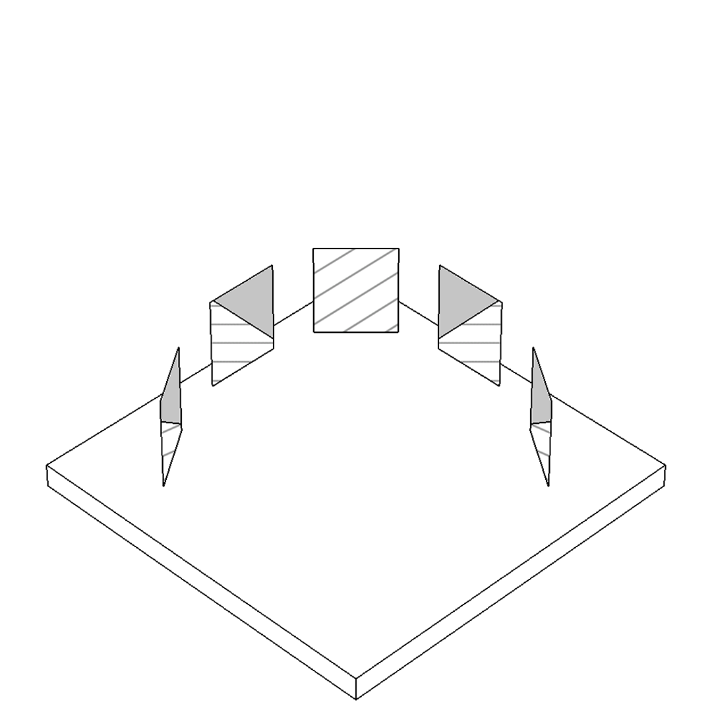
            <sub>Rendering of a Space that has opted for several smaller Portals, using a comparable amount of XP.</sub>
        </td>
    </tr>
</table>

### Uniform Resource Locators (URLs)

Systems, Spaces, and Portals can all be described by a common URL format. The general format is:

```
nfinity://SYSTEM[/USER[/SPACE[#PORTAL]]]
```

Where:
- `SYSTEM` is either:
  - a hexadecimal string starting with `0x` representing the tokenId of the System NFT, or
  - a unicode string representing the ENS name of the owner of the System NFT. In the case of an ENS name with a `.eth` TLD, the `.eth` suffix may be omitted.
- `USER` is either:
  - a hexadecimal string starting with `0x` representing the wallet address of a space owner, or
  - a unicode string representing the ENS name of a space owner. In the case of an ENS name with a `.eth` TLD, the `.eth` suffix may be omitted.
- `SPACE` is either:
  - a hexadecimal string starting with `0x` representing the tokenId of the Space NFT, or
  - a unicode string representing the name of the Space
- `PORTAL` is either:
  - a hexadecimal string starting with `0x` representing the internal id of the Portal, or
  - a unicode string representing the name associated with the Portal.

A URL for a System may omit the `SPACE` and `PORTAL` sections. For example, a URL to the Sol System looks like:

`nfinity://sol`

A URL for a Space may omit the `PORTAL` section and hash symbol. For example:

`nfinity://sol/earth/luna`

If a URL for a Space omits the `SPACE` section, `SPACE` will be presumed to be 'main'. So the following are equivalent:

`nfinity://sol/earth` and

`nfinity://sol/earth/main`

A URL may point to a Portal by omitting the `SYSTEM`, `USER`, and `SPACE` sections, retaining the hash (`#`) symbol, and using the hexadecimal ID of the Portal, prefixed by `0x`. The following is a direct URL to Portal with decimal ID 8675309:

`nfinity://#0x845FED`

A URL to a Space may be converted to a URL to a Portal by assuming that their is a Portal with the name `main` in that Space.

`nfinity://sol/earth` can be converted to

`nfinity://sol/earth/main#main`

Because this conversion may be done, the two can be considered equivalent, in the context of Portals.

#### Special URLs

Relative URLs may be crafted by replacing the path either entirely or partially with dot (`.`) characters.
- One dot means the URL is relative to the current System in context.
- Two dots means the URL is relative to the current User in context.
- Three dots means the URL is relative to the current Space in context

For example, the following URL points to a Portal within the current System in context, but a different User and Space:

`nfinity://./mars/phobos`

The following URL points to a Space owned by the current User in context.

`nfinity://../phobos`

The following URL points to a Portal within the current Space in context.

`nfinity://.../#hall`

Note that `..` in this schema does not mean "parent resource" like in Unix-based systems.

#### URLs as Structs in the Ethereum VM

Every Portal struct in Nfinity will have a destination field. The destination of a Portal has all of the same information that a URL has, but in a format that is more efficient for the Ethereum VM. The general schema of a Portal destination struct is:

```
struct DestinationUrl {
    uint256 system;
    uint8   systemType;
    uint256 user;
    uint8   userType;
    uint256 space;
    uint8   spaceType
    uint256 portal;
    uint8   portalType;
}
```

`system` can either be a tokenId of an Nfinity System, or the tokenId of an ENS domain name. If it is the former, `systemType` should be 0. If the latter, `systemType` should be 1.

`user` can either be a wallet address, or the tokenId of an ENS domain name. If it is the former, `userType` should be 0. If the latter, `userType` should be 1.

`space` can either be a tokenId of an Nfinity Space, or the sha256 (keccak256) hash value of the Space's name. If it is the former, `spaceType` should be 0. If the latter, `spaceType` should be 1.

`portal` can either be a tokenId of an Nfinity Portal, or the sha256 (keccak256) hash value of the Portal's name. If it is the former, `portalType` should be 0. If the latter, `portalType` should be 1.

`system`, `user`, and/or `space` may all have values of 0, which may be used to denote a relative URL. If all three (`system`, `user`, and `space`) are 0, and `portal` is a tokenId, then the URL is an absolute URL to the specific Portal with that tokenId.

### Issuance

The Nfinity Service will have a few phases where Spaces can be created:

1. Reserve
2. Pre-sale
3. Public sale

In all phases, when Spaces are minted, they immediately start accruing XP. This is always true for Spaces.

During the reserve phase, the Nfinity DAO will mint a finite quantity of Spaces that it will keep for future use. One use will be to create an Nfinity owned network of Spaces that can serve as one hub in the Metaverse. This cluster of Spaces could be a starting point for new entrants into a metaverse, comparable to Decentraland's Genesis Plaza. The DAO can also use these Spaces in the future to reward contributors or refund players in the event of a bug.

The pre-sale period will happen very shortly after the reserve phase. It will be a limited-time crowdfunding event where users can mint Spaces. The benefit to minting Spaces early is that they will immediately start accruing XP, so pre-sale contributors will have some of the most high-utility, high-value Spaces when the system launches. During the pre-sale period, Nfinity will have limited functionality, and virtually no partnerships or implementations slated. This period is primarily to secure space in Nfinity and to help kickstart Nfinity's efforts.

Once the model and service are finalized and deployed, the service will be activated so that the general public can mint Spaces.

## Implications

The Nfinity approach solves many other real-world problems that are sure to exist in the Metaverse if it ever hits critical mass.


### Migratory Dynamics

Several population phenomena occur in the real world that would not occur in a space-rich environment. We briefly describe some of them here.

**Overpopulation.** If a metaverse with limited space ever achieves mass adoption, one eventuality is that it will become overpopulated. Typically in the real world, government policies must ensure the safety and security of densely populated areas. They might even take drastic measures, like closing borders, or tightening the restrictions on potential immigrants. In Nfinity, none of this is necessary, because overpopulation is unlikely when there's abundant space. Furthermore, because Nfinity Space owners can choose their neighbors, they can choose how much of the surrounding system they want to participate in. So even simply the visual effects of overpopulation are avoidable.

**Gentrification.** Similarly, when space is limited, neighborhoods face the possibility of becoming gentrified. This usually happens when a population with more income moves into the area, driving up prices, causing residents to no longer be able to afford living there. But for the same reasons that overpopulation won't happen in Nfinity, no user will ever be forced out of their community. In fact, in Nfinity, we might see multiple communities entangled together without negatively affecting one another.

**Underprivileged Communities.** In the real world, some communities have been forced (often, systematically) into economic situations that are hard to recover from. As a result, their occupants have no means to exit the community. This is less likely to occur in Nfinity because there is practically no cost or barrier to changing one's community.

### New Medium

**3d World Wide Web.** Earlier, Nfinity's approach is described as a 3d implementation of hypertext. To reiterate, Spaces are hypertext documents for 3d content, Portals are hyperlinks to other Spaces. One side-effect to this approach is that it makes Spaces more easy to rank by relevance. Documents (Spaces) can be given higher precedence depending on how many Portals link to them. It would not be difficult to develop a Google PageRank-style algorithm for organizing and searching through Spaces.

In this respect, current metaverses that use grids and Euclidean geometry are akin to pre-web documents, like print. As an example, ad space in a newspaper is a Euclidean spatial system where the owner of one space can't choose the contents of its adjacent spaces. It is a paradigm that is easy for users to digest, but unimaginable as a user experience on the web. The Nfinity model modernizes metaverse land systems to take advantage of basic concepts introduced by the digital web.

**Self Expression.** It's possible for Space owners to use the features of Nfinity to develop new forms of self-expression; whether they're artistic, conceptual, organizational, etc. Virtual space has become a sort of 3d version of a customizable, social network profile page. In Nfinity, the customizability even extends to who one chooses as neighbors, and how they wish to display them. This could be both good and bad; an individual might create a Portal to their favorite neighbor and frame it with a heart shape. They might also create a Portal to an unliked neighbor and frame it with something more offensive. So not only will this create new forms of expression, but also new forms of cyber-bullying. Systems that provide opt-in, consensus-based censorship will need to be developed in a layer separate from Nfinity.

**Marketing Channel.** The Metaverse has already seen the emergence of a new market in which space can be sold for advertisements. In Nfinity, owners of a Space that is highly trafficked might be able to rent their Portals out to the highest bidders; similar to how influencers can market products to their followers. Similar to self-expression, there is good and bad that comes with this. One benefit to Nfinity's structure however is that Space owners can't be "locked-in" next to another Space owner that has filled their property with ads. So this is a new form of advertising that may be exploited, but it is also self-policing.

## Future Work

Nfinity introduces a new paradigm to virtual space, and there are many avenues for further exploration. The Nfinity DAO will ensure that these features and more are properly researched, evangelized, voted on, and potentially developed in the future.

**Filterable Portals.**
A way to tag Portals so that different metaverses can choose how to display them, or to ignore them altogether. For example, a metaverse that displays Portals purely for aesthetic purposes might want to only render Portals tagged with a `decoration` tag, and ignore all others. A metaverse that is intended to be a maze structure might only want to render Portals tagged with a `maze` tag.

**Searchable Portals.** Similar to the above, a tagging system could be used to create a folksonomy for Portals and their contents. For example, one user tags a Portal with the tag `cats` because it links to a Space with cat-related art. Another user searches for Portals tagged `cats` to find all the cat-related content in the Metaverse. Since 3d Portals are the gateways to this content, the search results are displayed in 3d too. The search engine constructs a temporary, dynamically generated hallway with many doorways. Each doorway connects to a Portal in the query's results. The user can walk through this custom-tailored hall to peek into each Space and browse its content.

**Programmable Portals.** Everything in the Metaverse has the potential to be programmable, and Portals are no exception. One approach is a system where Portals can delegate some (or all) of their attributes to another smart contract, a system of stewardship. Since Portals are not NFTs, the smart contract would not be able to do anything permanently destructive. There could be smart contracts that change a Portal's destination to the highest bidder. Or the account with the most recently acquired NFT from a collection. Or a random patron, to spotlight a Space owner's followers.

One can imagine a Space in Nfinity that is programmed to be a link aggregator. Like a 3d version of Reddit that uses Portals instead of hyperlinks. Upon each visit, the Portals link to a new set of dynamically chosen Spaces.

**Compatibility with Old Land Models.** Nfinity can coexist alongside land models that are built on artificial scarcity. There is incentive for artificially scarce models to integrate with Nfinity in a hybrid fashion. They would get the best of both worlds; a speculative land-economy, with the option for users to occupy non-speculative parts of their metaverse. Furthermore, if Nfinity becomes a widely adopted model, antiquated models might struggle to retain users (and high land valuations).

A simple way to enable a hybrid model is to maintain a bidirectional map of traditional land to Nfinity Spaces in a Smart Contract. Users would need to explicitly "merge" their land and Space together using that contract, for example:


    interface ERC721 {
        function ownerOf(uint256 _tokenId) external view returns (address);
    }

    contract Merger {
        mapping (uint => uint) public mapLandToSpace;
        mapping (uint => uint) public mapSpaceToLand;

        address constant public landContract  = 0x1234...;
        address constant public spaceContract = 0xABCD...;

        function getNftOwner(address contractAddress, uint tokenId) internal view returns(address) {
            return ERC721(contractAddress).ownerOf(tokenId);
        }

        function merge(uint landId, uint spaceId) external {
            require(getNftOwner(landContract,  landId)  == msg.sender);
            require(getNftOwner(spaceContract, spaceId) == msg.sender);

            mapLandToSpace[landId]  = spaceId;
            mapSpaceToLand[spaceId] = landId;
        }
    }


The metaverse client would then simply need to query the contract to determine the relationship between land and Spaces.

**Centralized Games.** Games that are better suited as centralized experiences can still use Nfinity to generate and connect land within the game. For example, a game like Minecraft can use the Portal definitions from Nfinity to overlay Portals in a Minecraft Realm. The Portals can connect users' different Minecraft Realm instances together. This would require some similar functionality to the Merger contract above, but could technically be stored in a traditional, centralized database.

**Usage-Based Appreciation of Utility.** A more advanced XP-accrual process could be implemented, one that rewards benevolent use of the space. For example, XP accrual could be accelerated when other Spaces connect to one's Portals. It could be accelerated for Spaces that have used their XP for Upgrades. There could even be a voting system where users vote for which Spaces should accrue XP faster. In general, the goal is to reward landowners for making the Metaverse a more accessible and/or lively place.

## The Nfinity DAO

All aspects of Nfinity will be governed by a decentralized autonomous organization (DAO). The DAO will start by democratically defining the Nfinity model (this document). Eventually, the responsibilities of the DAO will be to develop and deploy the Nfinity service. After that, the DAO will continue refining the model, maintaining the service, and working in the interests of fair land in the Metaverse.

### Partnerships and Evangelism

For Nfinity's model and service to gain critical mass and acceptance, there will need to be an extensive effort to create partnerships, to ensure that new and existing projects adopt Nfinity. The Nfinity DAO will use some of the funds from its service's operation to market and evangelize Nfinity to Metaverse projects. The main attractions for new projects to use Nfinity as a spatial layer are:

1. The model will have been democratically chosen, and eventually proven.
2. Development time will be faster. New projects don't have to implement their own land system.
3. Faster user adoption. Users with land in Nfinity can quickly put it to use in another Metaverse. Also, the Nfinity DAO can cross-promote and help market metaverses that use Nfinity.

Up-and-coming metaverses will see the biggest benefits to partnering with Nfinity. Existing Metaverse projects might find that Nfinity is redundant or conflicting with their model. The Nfinity DAO will work with them to find a way to incorporate both models to the benefit of all. For example, in Decentraland, Spaces and plots could be merged by their owners so that Portals from Nfinity are pulled into Decentraland. Those Portals can take users to other plots in Decentraland if they've also been merged with an Nfinity Space.

In addition to a partnership program, Nfinity will use some of its funds to invest in upcoming Metaverse projects that can commit to using Nfinity. The DAO will define the terms of the program, investment amounts, acceptance criteria, etc.

### Reference Implementations and Developer Tools

The Nfinity DAO will fund the creation of lightweight metaverses to both prove the viability of Nfinity, and to provide the development community with templates for creating their own metaverses.

The first such reference implementation will be a 3d NFT art gallery, tentatively called the Nfinity Mall. That metaverse will dynamically generate a 3d art gallery for any Ethereum user's wallet, and overlay it over their space. It will render the Portals from Nfinity so that users may connect their galleries with others.

The Nfinity DAO will also produce open-source libraries and frameworks in popular game-development ecosystems to help developers build on top of Nfinity.

Beyond those projects, the development of a larger-scale metaverse might be warranted if incumbent metaverse offerings don't adopt Nfinity. In this case, Nfinity would create a full content system as a separate layer above the spatial system. The Nfinity DAO will vote on which effort to focus time and money into.

## Conclusion

The Metaverse has many criticisms, most of which stem from the overtly non-competitive market caused by artificial scarcity. We have described some of the self-sabotaging effects that this approach has had on the market and its adoption. The perception of the Metaverse is that land is extremely overvalued, it's being occupied mostly by squatters, and they've left it a barren wasteland, devoid of any compelling content. However, the worst offense is the sum of these flaws; the Metaverse is recreating problems that exist in the real world, but are entirely avoidable in a virtual world. The Metaverse was once seen as an escape from the inequities and limitations of real-life. But to many, it is instead an extension of the problems they face in the real world. With the two realities being essentially equivalent, it's understandable why many are hesitant to accept the Metaverse.

Nfinity intends to provide a framework and service so that virtual worlds can fulfill the promise of transcending physical limitations. It is a modern economic model that takes advantage of the abundance in virtual worlds to create a fair, equitable system of land ownership. It solves many problems that exist in real estate today and creates a more inclusive, accessible, and collaborative virtual environment that anyone can participate in. Nfinity is a new paradigm in virtual space that can have a positive impact on the direction of the Metaverse in the years to come.

## Notes and Further Reading

### Notes

1. In practicality, "infinite space" cannot be achieved in a virtual world due to limitations in the physical world. There are plenty of oft-cited arguments for this position; integer overflow (which of course, can be worked around), the sun's exhaustion of hydrogen, the heat death of the universe, etc. However, the role of Nfinity is to conceptually define an economy as if land _were_ infinite, ignoring the limits of computation, space, time, entropy, etc., with the concession that if these problems become a threat, they will either be solved, or their effects on Nfinity will be irrelevant.

2. It is well known that the virtuous cycle of economic growth only holds true while resources are abundant. It breaks down when resources, specifically food, become scarce. Commonly referred to as a Malthusian Trap, it is essentially proven to be a non-issue long-term [5], as well as in systems that don't rely on consumable resources.

### Further Reading

1. [Land speculators will kill your game's growth](https://www.gamedeveloper.com/business/digital-real-estate-and-the-digital-housing-crisis)

2. Ted Nelson. 1965. [Complex information processing: a file structure for the complex, the changing and the indeterminate](https://dl.acm.org/doi/10.1145/800197.806036). In Proceedings of the 1965 20th national conference (ACM '65). Association for Computing Machinery, New York, NY, USA, 84–100.

3. [Portal: Orientation Video no. 1](https://www.youtube.com/watch?v=TluRVBhmf8w)

4. [Wikipedia: Experience Points - Cash-in advancement](https://en.wikipedia.org/wiki/Experience_point#Cash-in_advancement)

5. Julian Simon. 1981. [The Ultimate Resource](http://www.juliansimon.com/writings/Ultimate_Resource/). Princeton University Press. Princeton, NJ.

6. [Virtual Land in the Metaverse](https://matthewscottjones.com/virtual-lands-in-the-metaverse/)

7. [Artificial Scarcity Will Hurt the Metaverse](https://medium.com/the-ultra-reality/artificial-scarcity-will-hurt-the-metaverse-5609bbc82b1a)

8. [The Metaverse Land Rush Is an Illusion](https://www.wired.com/story/metaverse-land-rush-illusion/)

9.  [Metaverse Scarcity Isn’t Real](https://www.coindesk.com/layer2/2022/01/11/metaverse-scarcity-isnt-real/)

